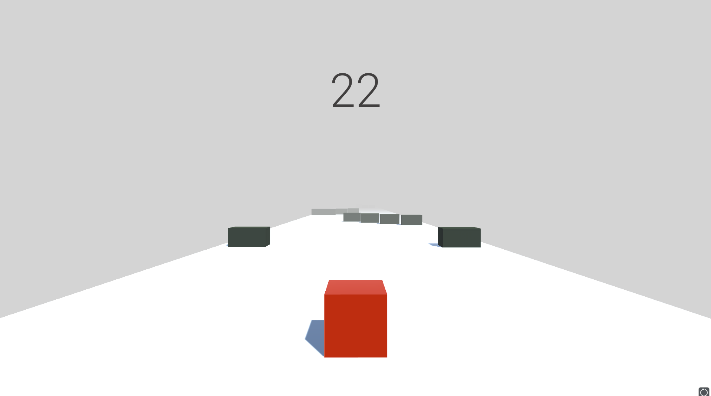
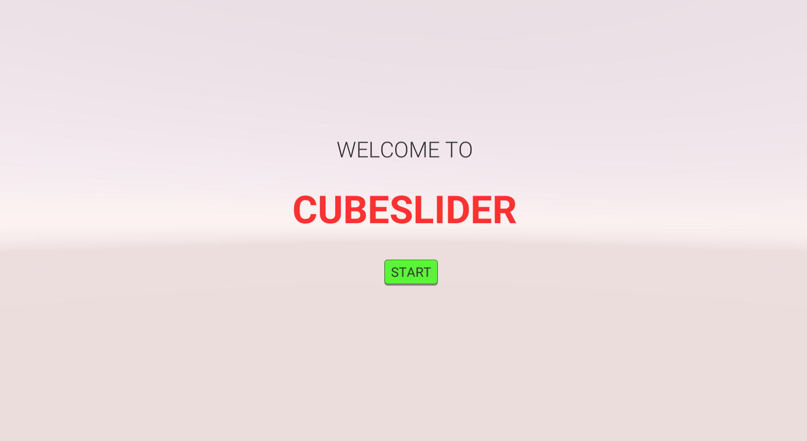
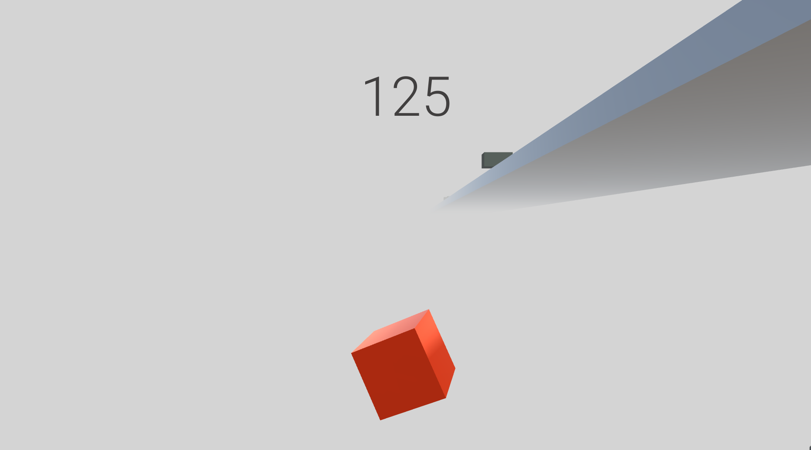
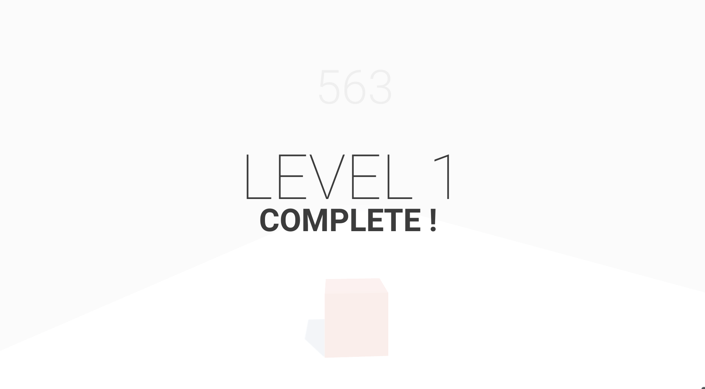

# CubeSlider
CubeSlider is a simple obstacle game created using Unity and C#.

## Installing the Game
You can play this game by downloading and installing the [setup file](CubeSlider_Setup%20(x86).exe)

## About
The game has four levels. The difficulty of each level was increased by decreasing the distance between the obstacles and increasing the speed of the game. 

The game UI and Scenes are controlled by buttons and triggers. 
Triggers were placed at the end of each level to automatically load the next level through an animation script. 

## Game UI

The game UI was created using the various UI elements in Unity.

### 1. The Start Page: 

This is the first scene that is loaded when the game is played.

### 2. Game Over:

The level resets whenever the player collides with an obstacle or falls off the ground.

### 3. Level Transition UI:

The game has four levels. If a user completes a level, an animation script is deployed that loads the next level.

## Future Development Plans: 

1. Optimize movement script for a smoother playing experience. 
2. Add scripts to auto-generate obstacles.
3. Add "High Score" feature to save the progress of the player.
4. Add coins
5. Add a store to optimize and change the color of player, obstacles, ground, background using coins earned in the game.
